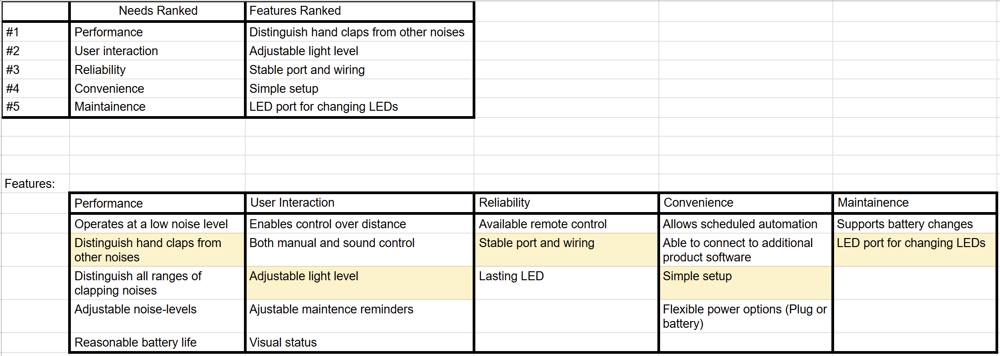
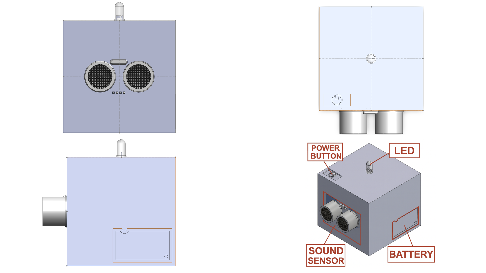
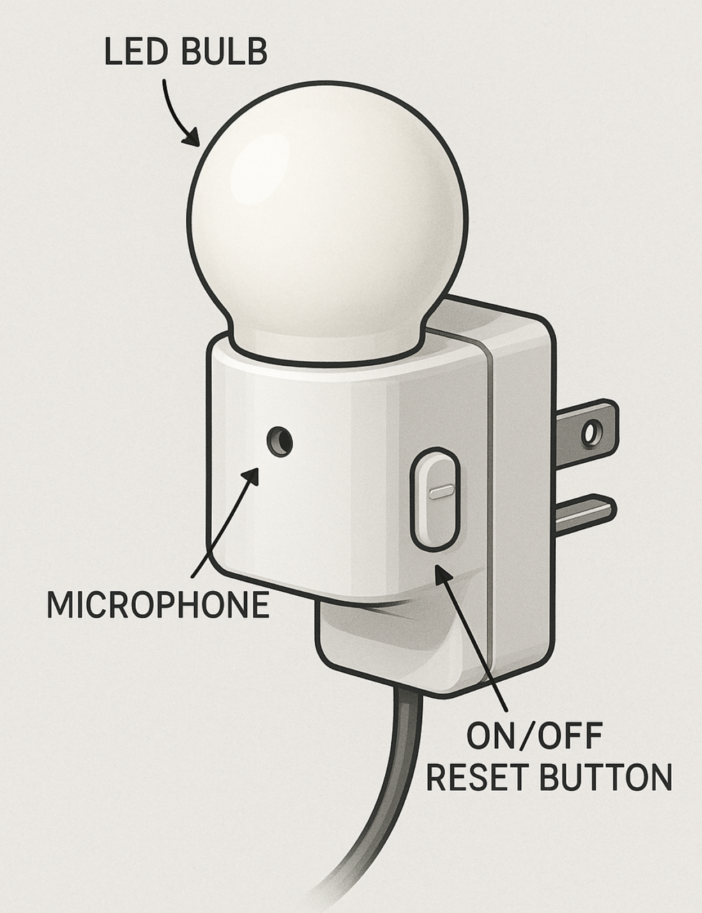
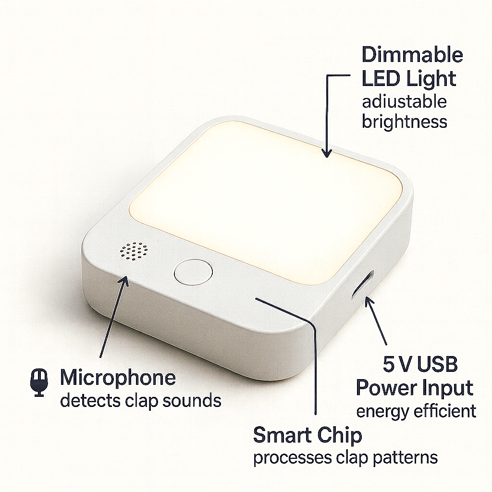

## Intro/Overview

We’ve all had moments when we’re too tired to get out of bed just to flip a light switch, or we’ve stumbled around in the dark trying to find it. Our team’s idea is a clap-activated light that solves this problem in a simple and safe way. It’s especially helpful for people who wake up early, college students with busy schedules, or seniors who may find moving around at night difficult.

On this page, we share how we brainstormed and organized ideas for the clap light. We started by looking back at the [user needs](https://asu-egr304-2025-f-204.github.io/03-User-Needs-and%20Benchmarking/) we identified earlier, then came up with as many features as possible. From there, we grouped and ranked the best ones and built three unique product concepts that show different ways the clap light could be designed.

## Generating Ideas

Based on the [user needs](https://asu-egr304-2025-f-204.github.io/03-User-Needs-and%20Benchmarking/) we identified earlier (convenience, accessibility, safety, and affordability), our team brainstormed potential features for the clap light. For each requirement, we listed at least five ideas. Below is a sample of our brainstorm table:

|                   requirement / need |             feature              | detail                                                                      |
| -----------------------------------: | :------------------------------: | --------------------------------------------------------------------------- |
| The product enables control from a distance. | Wi-Fi Module | The device connects to the home network for remote access via the internet. |
| The product enables control from a distance. | Bluetooth | The device allows for short-range direct control from a smartphone or remote. |
| The product enables control from a distance. | RF Remote | The device includes a dedicated radio frequency remote for long-range control without line-of-sight. |
| The product enables control from a distance. | Cloud Integration | The device syncs with a cloud service, enabling control from anywhere with an internet connection. |
| The product enables control from a distance. | Mobile App | A companion app provides a full interface for controlling the device remotely. |
| Reliable remote control | Signal Booster | An internal amplifier strengthens the wireless signal to prevent dropouts. |
| Reliable remote control | Error-Correcting Protocols | The device uses communication protocols that automatically detect and correct transmission errors. |
| Reliable remote control | Dual-Band Wi-Fi Support | The device can operate on both 2.4GHz and 5GHz bands to avoid interference. |
| Reliable remote control | Heartbeat Monitoring | The device regularly sends status updates to the app to confirm the connection is active. |
| Reliable remote control | Auto-Reconnect | The device automatically attempts to re-establish connection if it is lost. |
| Adjustable maintenance reminders | Customizable Schedules | The user can set specific intervals (days, weeks, months) for maintenance alerts via the app. |
| Adjustable maintenance reminders | On-Device Menu | An LCD screen and button interface allow for setting reminders directly on the device. |
| Adjustable maintenance reminders | Multiple Reminder Types | The system supports different reminders for filter changes, cleaning, and component check-ups. |
| Adjustable maintenance reminders | Snooze Function | The user can temporarily postpone a reminder for a set period. |
| Adjustable maintenance reminders | History Log | The app maintains a log of past maintenance activities and upcoming scheduled reminders. |
| Reliable connectivity once set up | WPS Pairing | Features Wi-Fi Protected Setup for one-touch, secure connection to the router. |
| Reliable connectivity once set up | Stable Chipset | Uses a high-quality, industrial-grade wireless communication chipset. |
| Reliable connectivity once set up | Network Status LED | A dedicated LED indicator visually shows the strength and stability of the connection. |
| Reliable connectivity once set up | Wired Ethernet Port | Provides a fallback option for a hardwired, ultra-reliable network connection. |
| Reliable connectivity once set up | Signal Strength Test Mode | A built-in mode helps the user find the optimal location for the best signal during setup. |
| Reasonable battery life with clear low-battery alerts | High-Capacity Battery | Uses a long-life lithium-ion battery pack suitable for extended use. |
| Reasonable battery life with clear low-battery alerts | Power-Efficient Processor | The main processor uses low-power states when idle to conserve energy. |
| Reasonable battery life with clear low-battery alerts | Multi-Stage Low-Battery Alert | The device provides an early warning (e.g., 20%) and a critical warning (e.g., 5%) via LED, sound, and app notification. |
| Reasonable battery life with clear low-battery alerts | Battery Saver Mode | An optional mode reduces non-essential functions to extend battery life. |
| Reasonable battery life with clear low-battery alerts | Accurate Battery Percentage Display | The app and device display show a precise remaining battery percentage. |
| Maintain clear nighttime visibility | Auto-Dimming OLED | The display automatically adjusts its brightness based on ambient light levels. |
| Maintain clear nighttime visibility | Red LED Mode | Uses red-colored LEDs for status indicators, which are less disruptive to night vision. |
| Maintain clear nighttime visibility | Proximity Sensor | The display turns off or dims when no one is nearby to prevent light pollution. |
| Maintain clear nighttime visibility | Scheduled Display Off | The user can set times for the display to turn off completely during sleeping hours. |
| Maintain clear nighttime visibility | Gentle Wake-Up Light | Can be programmed to gradually brighten in the morning as a gentle alarm. |
| Distinguishes hand claps from other noises | Advanced Digital Signal Processing (DSP) | Analyzes sound waveforms to identify the unique acoustic signature of a clap. |
| Distinguishes hand claps from other noises | Pattern Recognition | Recognizes clap patterns (e.g., double clap) to differentiate from random noises. |
| Distinguishes hand claps from other noises | Adjustable Sensitivity | Allows the user to set the sensitivity level to ignore quieter background noises. |
| Distinguishes hand claps from other noises | Background Noise Sampling | Periodically samples ambient noise to filter out constant sounds like fans or traffic. |
| Distinguishes hand claps from other noises | Frequency Filtering | Focuses on the specific frequency range typical of hand claps. |
| Runs automatically at preset times without user intervention. | Real-Time Clock (RTC) | An internal clock keeps accurate time, even during short power outages. |
| Runs automatically at preset times without user intervention. | Multiple Timers | Supports the creation of multiple, complex daily or weekly schedules. |
| Runs automatically at preset times without user intervention. | Sunset/Sunrise Offset | Can trigger actions based on local sunset or sunrise times, automatically adjusting throughout the year. |
| Runs automatically at preset times without user intervention. | Randomization Mode | Can vary activation times slightly to appear more natural (e.g., for lights). |
| Runs automatically at preset times without user intervention. | Battery Backup for RTC | A small backup battery maintains the clock settings during a main power failure. |
| Operates at a low noise level suitable for daily routines. | Quiet Fan Design | Uses a brushless DC fan with aerodynamic blades designed for silent operation. |
| Operates at a low noise level suitable for daily routines. | Vibration Dampers | Internal components are mounted with dampers to prevent noise from vibration. |
| Operates at a low noise level suitable for daily routines. | Acoustic Insulation | Sound-absorbing material lines the interior casing to muffled operational sounds. |
| Operates at a low noise level suitable for daily routines. | Silent Relay Switches | Uses solid-state relays (SSRs) instead of mechanical ones for silent switching. |
| Operates at a low noise level suitable for daily routines. | Low-Noise Motor | Any motors used are specifically selected or designed for minimal audible output. |
| Requires minimal maintenance over time. | Self-Cleaning Filter | An air filter includes a mechanism (e.g., electrostatic) to reduce dust accumulation. |
| Requires minimal maintenance over time. | Solid-State Components | Uses components with no moving parts where possible to reduce wear and tear. |
| Requires minimal maintenance over time. | Corrosion-Resistant Coating | Internal circuitry is coated to protect against humidity and oxidation. |
| Requires minimal maintenance over time. | Automatic Self-Test | Periodically runs a diagnostic check on its own functions and reports any issues. |
| Requires minimal maintenance over time. | Easy-Access Design | The housing is designed for tool-less opening for easy cleaning or inspection. |
| Allow scheduled automation | Intuitive Scheduler in App | The mobile app features a simple, calendar-like interface for setting schedules. |
| Allow scheduled automation | Conditional Logic (IFTTT) | Supports applets (e.g., IFTTT) to create rules based on conditions from other services. |
| Allow scheduled automation | Geo-Fencing | Can automatically trigger actions when the user's smartphone leaves or enters a set area. |
| Allow scheduled automation | Vacation Mode | A single setting that randomizes operation to simulate occupancy while away. |
| Allow scheduled automation | Scene Profiles | Allows saving groups of settings (e.g., "Movie Night") that can be scheduled or activated instantly. |
| Should have scheduling through an app rather than extra hardware | Dedicated Mobile Application | All scheduling and configuration are done through a comprehensive smartphone app. |
| Should have scheduling through an app rather than extra hardware | QR Code Setup | The device can be quickly added to the user's account by scanning a QR code with the app. |
| Should have scheduling through an app rather than extra hardware | Cloud-Based Configuration | Schedules are stored in the cloud, allowing access and modification from any device with the app. |
| Should have scheduling through an app rather than extra hardware | User Profile Sync | User settings and schedules are synced across multiple smartphones. |
| Should have scheduling through an app rather than extra hardware | In-App Tutorials | The app includes guided walkthroughs for setting up schedules and automations. |
| Can distinguish all ranges of clapping noises | Wide Dynamic Range Microphone | Captures sounds from quiet to loud without distortion, ensuring clear clap detection. |
| Can distinguish all ranges of clapping noises | Adaptive Gain Control | Automatically adjusts the microphone's sensitivity to handle both nearby and distant claps. |
| Can distinguish all ranges of clapping noises | Multi-Clap Detection | Can be trained or set to recognize a specific number of claps in a sequence. |
| Can distinguish all ranges of clapping noises | Echo Cancellation | Algorithms filter out echoes in large or reverberant rooms to prevent false triggers. |
| Can distinguish all ranges of clapping noises | Confidence Scoring | Assigns a confidence score to detected sounds, only acting on those highly likely to be a valid clap. |
| Should allow both manual and remote control | Physical Control Panel | Includes buttons or a touch interface on the device for manual operation. |
| Should allow both manual and remote control | Voice Assistant Integration | Works with Amazon Alexa, Google Assistant, etc., for voice commands. |
| Should allow both manual and remote control | Universal Remote Compatibility | Can be learned by universal remotes that use IR or RF. |
| Should allow both manual and remote control | Local Network Control | Can be controlled directly from devices on the same Wi-Fi network without internet. |
| Should allow both manual and remote control | Manual Override | Any automated action can be immediately overridden by a manual command without disabling the schedule. |
| Has different noise-levels adjustable for different times of day | Time-Based Profiles | Sound output levels (e.g., for alerts) can be set to different volumes for Day, Evening, and Night. |
| Has different noise-levels adjustable for different times of day | Gradual Volume Adjustment | Volume changes occur gradually to avoid sudden, startling changes. |
| Has different noise-levels adjustable for different times of day | Do Not Disturb Schedule | Automatically silences all non-critical notifications during scheduled quiet hours. |
| Has different noise-levels adjustable for different times of day | Independent Channel Control | Allows different volume settings for different types of alerts (e.g., alarms vs. status chimes). |
| Has different noise-levels adjustable for different times of day | Cross-Fade Audio | Uses audio cross-fading techniques to make sound transitions smoother. |
| Can be easily programmed to utilize other home appliances that might relate | Standard Smart Home Protocols | Supports common protocols like Zigbee, Z-Wave, or Matter for interoperability. |
| Can be easily programmed to utilize other home appliances that might relate | API Access | Provides a documented API for advanced users to create custom integrations. |
| Can be easily programmed to utilize other home appliances that might relate | Built-In Device Library | The app contains a library of pre-configured commands for popular smart devices. |
| Can be easily programmed to utilize other home appliances that might relate | IR Blaster | Includes an infrared transmitter to control legacy appliances like TVs and ACs. |
| Can be easily programmed to utilize other home appliances that might relate | Routine Builder | A simple drag-and-drop interface in the app to create multi-device routines. |
| Product is convenient to use or set up. | Plug-and-Play Design | Requires minimal assembly and starts guided setup immediately upon powering on. |
| Product is convenient to use or set up. | Pictogram Instructions | Setup instructions use clear images and icons, minimizing language barriers. |
| Product is convenient to use or set up. | Assisted Wi-Fi Configuration | The app automatically suggests optimal Wi-Fi settings and guides the connection process. |
| Product is convenient to use or set up. | Magnetic Mounting | Includes strong magnets for easy attachment to metal surfaces without tools. |
| Product is convenient to use or set up. | Quick Start Guide | A simplified, single-page guide gets the user operational in minimal steps. |
| Product is simple to maintain. | Filter Replacement Indicator | An LED or app notification clearly signals when a filter needs replacing. |
| Product is simple to maintain. | Modular Components | Key parts subject to wear are designed as easily swappable modules. |
| Product is simple to maintain. | Self-Diagnostic Codes | The display shows simple error codes that correspond to clear troubleshooting steps in the manual. |
| Product is simple to maintain. | Cleanable/Reusable Filters | Filters are designed to be vacuumed or rinsed clean instead of replaced. |
| Product is simple to maintain. | Online Maintenance Videos | QR codes link directly to short video tutorials for common maintenance tasks. |
| Clear guidance on when extra power is required | Adaptive Power Mode | The device automatically switches to a lower-power mode when not on mains electricity. |
| Clear guidance on when extra power is required | On-Screen Power Source Indicator | The display clearly shows whether it's running on battery or AC power. |
| Clear guidance on when extra power is required | App-Based Power Management | The app provides detailed power usage statistics and projections for battery life. |
| Clear guidance on when extra power is required | Audible Alert for AC Disconnect | Emits a specific sound when plugged-in power is disconnected. |
| Clear guidance on when extra power is required | Task-Specific Power Warnings | Warns the user if a scheduled task requires more power than the battery can provide. |
| Offer flexible power options (battery and hardwire) | Dual Power Input Ports | Has separate ports for a DC power adapter and for connecting a battery pack. |
| Offer flexible power options (battery and hardwire) | Automatic Source Switching | Seamlessly switches to battery power if the main AC power is cut. |
| Offer flexible power options (battery and hardwire) | External Battery Pack Compatibility | Can be used with common, commercially available USB power banks. |
| Offer flexible power options (battery and hardwire) | Wide Voltage Input | Accepts a range of input voltages (e.g., 100-240V AC) for international use. |
| Offer flexible power options (battery and hardwire) | Power Adapter Included | Comes with a compatible wall plug adapter in the box. |

## Our Ranking

## Basic Clap Light CADD Model

## Smart Clap Light
Modern design with app integration, touch controls, and voice assistant compatibility.

{width="300" height ="300"}

## Accessible Clap Light
The Accessible Clap Light is a modern, sound-activated lighting device designed to improve convenience and independence for users of all abilities.

{width="300" height ="300"}

## Clap Light Animation Video
<iframe width="560" height="315" src="https://www.youtube.com/embed/kkLrAL8x8Js?si=U7ngWnCirqjngvhX" title="YouTube video player" frameborder="0" allow="accelerometer; autoplay; clipboard-write; encrypted-media; gyroscope; picture-in-picture; web-share" referrerpolicy="strict-origin-when-cross-origin" allowfullscreen></iframe>

## Design Ideation Documentation

Over the course of the week, our team worked on this assignment, and we met up twice.

In our first meeting, we established what the workload of the assignment was going to look like, and we divided the work evenly so that everybody did what they were most capable of doing.

We focused on what everybody could accomplish best, as well as maintaining an equitable workload for each member. Through this, we established that Aaron would do a computer animation of the project as one of the concept sketches, as he has familiarity with computer animation. We also established that Roshan would create a CAD model of a concept design that we could take. We decided to leave the last concept sketch up to Caleb, as we would discuss roles with him at a later time in person. We decided that Quinn would document the meetings, as well as any communication that occurred for documentation. This establishment, prior to a more in-depth discussion, was essential to most efficiently completing each of the assigned steps in a way that minimized chaos or confusion.

In order to efficiently get these 100 features, we individually noted topics relevant to the user requirements already established in our section on [Product Requirements](https://asu-egr304-2025-f-204.github.io/04-Product-Requirements/); overlap in individually noted topics allowed us to more easily rank our ideas. We then shared these topics over Google Sheets and in our discussion, and went one by one through them, rapid-firing any idea related to the topic in order to quickly get many ideas and features, and not leave anybody out. Although we were unable to establish all 100 features in one meeting, it made sense to wait to finish discussing possible features or solutions until Caleb was present, so we could get equal contributions from everybody.

In our second meeting, Caleb, Quinn, and Aaron met and finished establishing possible features and were able to further discuss workloads. Caleb’s concept was established, and he thereafter decided to make a schematic drawing for it.

The group was also briefly able to meet on Wednesday during class, but most of the rest of the important communication was completed over text and email. Thanks to our in-depth communication during our meetings, no big mishaps occurred, and all further communication could be done simply over text.
