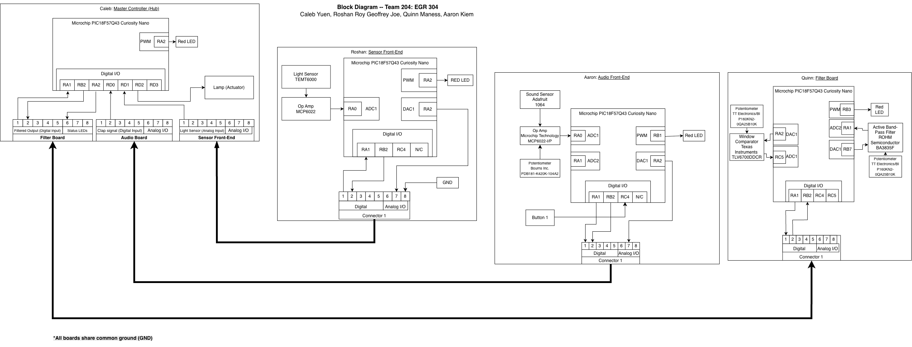

## Introduction

Our team designed a hub-and-spoke block diagram for the clap-activated smart light project. The Master Controller (Caleb) serves as the Hub, coordinating signals from the Audio Front-End (Aaron), Filter Board (Quinn), and Sensor Front-End (Roshan). Each board is based on the PIC18F57Q43 Curiosity Nano and communicates via an 8-pin ribbon cable standard. The Hub also drives the lamp actuator, which serves as the system’s main physical output.

## Research Question

* How can we design a modular clap-activated smart light using distributed microcontrollers?
* Which subsystem should handle audio filtering, user interaction, and lamp switching for best reliability?
* How can the hub coordinate signals with minimal false triggers?

## Images

## Results

1. The system is organized using a hub-and-spoke model, with Caleb’s board as the central controller.
2. Each teammate has one subsystem:
    * Caleb: Master Controller (Hub) – coordinates inputs and controls the lamp actuator
    * Aaron: Audio Front-End – detects clap signals using a microphone and op-amp
    * Roshan: Sensor Front-End – measures ambient light levels for adaptive brightness
    * Quinn: Filter Board – processes potentiometer inputs and displays system status using LEDs
3. The 8-pin ribbon connector standard ensures consistent power, ground, and communication lines across all boards.

## Conclusions and Future Work

We have quite a bit that we need to further elaborate on. The intricacies of the actual subsystems and how they will all interact alongside the code will likely be a complicated task that will require skilled teamwork. Getting the separate code from each individual design to work in conjunction will likely be very difficult. We will also need to figure out what system of UI we will use, such as analog or digital, as this is an area that we have less experience with. As a whole, the block diagram will prove to be extremely useful in terms of simplifying the design into easily understood and visualized compartments. However, actually implementing such a design in practice will require more extensive research.

## References

[Curiosity Nano hardware user guide](https://ww1.microchip.com/downloads/aemDocuments/documents/MCU08/ProductDocuments/UserGuides/PIC18F57Q43-Curiosity-Nano-HW-UserGuide-DS40002186B.pdf)
