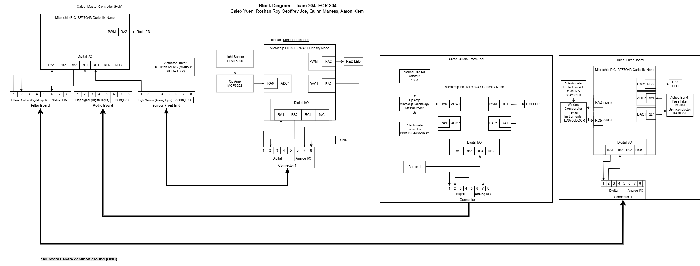

## Introduction

Our team designed a hub-and-spoke block diagram for the clap-activated smart light project. The Master Controller (Caleb) serves as the Hub, coordinating signals from the Audio Front-End (Aaron), Light Sensor Board (Quinn), and Sensor Front-End (Roshan). Each board is based on the PIC18F57Q43 Curiosity Nano and communicates via an 8-pin ribbon cable standard. The Hub also drives the lamp actuator, which serves as the system’s main physical output.

## Research Question

* How can we design a modular clap-activated smart light using distributed microcontrollers?
* Which subsystem should handle audio filtering, user interaction, and lamp switching for best reliability?
* How can the hub coordinate signals with minimal false triggers?

## Images

## Results

1. The system is organized using a hub-and-spoke model, with Caleb’s board as the central controller.
2. Each teammate has one subsystem:
    * Caleb: Master Controller (Hub) – coordinates inputs and controls the lamp actuator
    * Aaron: Audio Front-End – detects clap signals using a microphone and op-amp
    * Roshan: Sensor Front-End – measures ambient light levels for adaptive brightness
    * Quinn: Light Sensor Board – senses outside light to automatically shut off system
3. The 8-pin ribbon connector standard ensures consistent power, ground, and communication lines across all boards.

## Conclusions and Future Work

We have quite a bit that we need to further elaborate on. The intricacies of the actual subsystems and how they will all interact alongside the code will likely be a complicated task that will require skilled teamwork. Getting the separate code from each individual design to work in conjunction will likely be very difficult. As a whole, the block diagram will prove to be extremely useful in terms of simplifying the design into easily understood and visualized compartments. However, actually implementing such a design in practice will require more extensive research.

## Changes Since Software Proposal
1. Hierarchy - There was a significant problem with the code of the Master Controller that prevented the process from running in the correct order. This was the most significant issue, as the hierarchy of who overrides who, what systems should work together, etc. should be determined and implemented, else the system not work. Although somewhat simple to solve (just make it clear which code has priority), it prevented the systems from functioning cohesively.
2. Jitter - A problem that arrived both from hardware and software issues was a lack of smoothness from some systems. This was both due to a lack of bypass/decoupling capacitors and unrefined code. Though it was too late to alter capacitors (since that's hardware), refining the code was necessary to making a high quality system.
3. Responsiveness - The light sensor system would be largely unresponsive for around 5 seconds after it turned on, which was suboptimal for a system that's supposed to be sleek and feel easy to use. This was fixed by refining the code to have less delay and determine inputs more quickly.
4. Outputs - Seeing as out group had never done anything this complex before, how to properly configure the system so that output voltages would optimally apply to each component was something that needed adjusting. At times, removing an LED was necessary and had little to no effect on the final product, or simply adjusting output values or resistance levels could resolve the issue.
5. Intuitiveness - Many of the system's softwares were unintuitive and therefore somewhat difficult to adjust, especially in combination with needing to be applied to other team members' softwares at the same time. Simply having a teammate go through and ask questions, therefore allowing the programmer to add notes or simplify when needed, was all that was required for this issue to be resolved.

## References

[Curiosity Nano hardware user guide](https://ww1.microchip.com/downloads/aemDocuments/documents/MCU08/ProductDocuments/UserGuides/PIC18F57Q43-Curiosity-Nano-HW-UserGuide-DS40002186B.pdf)
