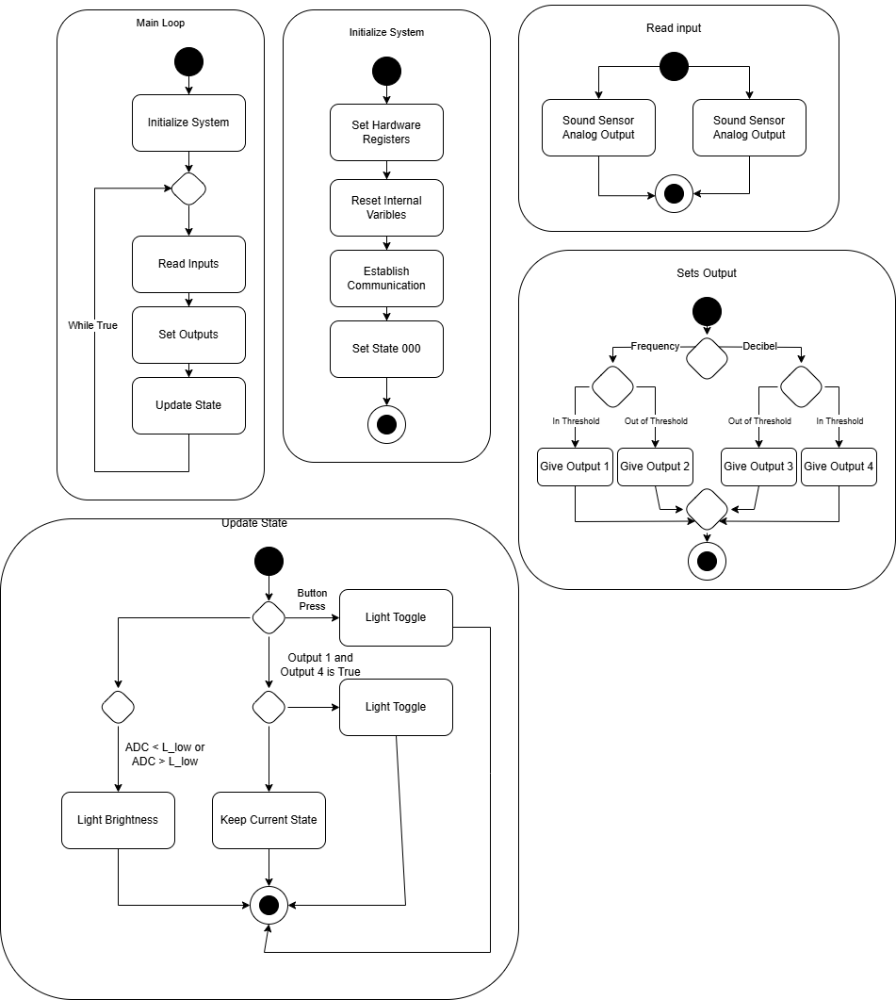

## Introduction

Our software architecture defines the logical flow and decision-making process for the ClapSense product.  
The system operates in a continuous loop, processing audio signals, evaluating thresholds, and updating light output and brightness based on detected input.

This diagram illustrates how each subsystem — Initialization, Input Reading, Output Setting, and State Updating — interacts under the control of the PIC18F57Q43 Curiosity Nano microcontroller.

## System-Level Activity Diagram

### Initialize System
* Configures hardware registers and resets internal variables.  
* Establishes communication between subsystems and sets the initial default state (`000`).  
* Ensures all hardware peripherals (ADC, GPIO, and UART) are configured before entering the main loop.

### Read Input
* Collects analog sound data from the microphone/sound sensor.  
* Uses the ADC to convert sound amplitude into a digital value for comparison.  
* Filters and interprets clap patterns to detect user input for toggling the light.

### Set Output
* Compares input data (frequency and decibel levels) against defined thresholds.  
* Controls output pins for lighting, using the results of threshold checks.  
* Enables proper state transitions (ON/OFF toggle or brightness adjustments).  
* Implements both frequency-based and decibel-based decision paths.

### Update State
* Handles user interface interactions such as button presses or brightness adjustments.  
* Monitors ADC readings to determine if brightness should increase or decrease.  
* Toggles the light output when valid clap or button signals are detected.  
* Returns to the main loop after updating the system state.

## 📚 References
* [Curiosity Nano hardware user guide](https://ww1.microchip.com/downloads/aemDocuments/documents/MCU08/ProductDocuments/UserGuides/PIC18F57Q43-Curiosity-Nano-HW-UserGuide-DS40002186B.pdf)

